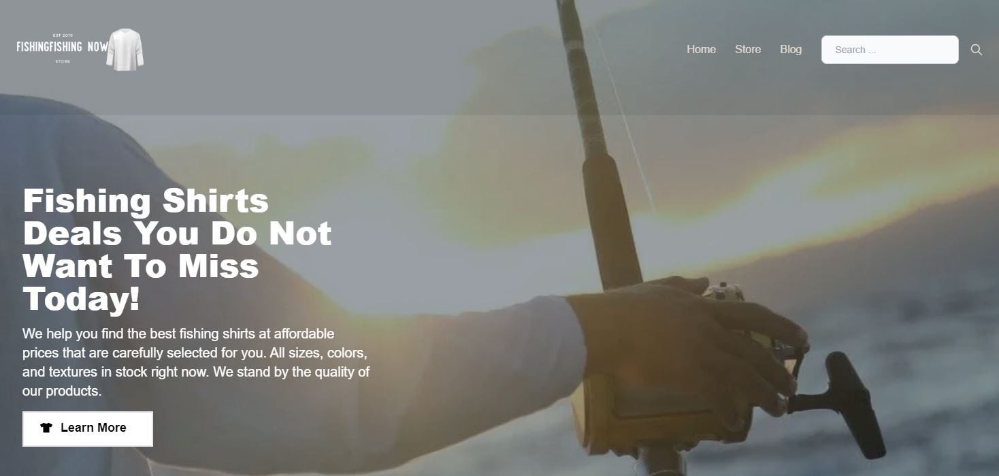

# Fishing Shirts Website



Fishing Shirts website to help users find the best deals from various high-quality Amazon products; the project uses react, and the next.js framework makes it fast, user-friendly, and SEO-friendly.

## Installation

1. Download repository
   ```bash
   git clone https://github.com/alfredodr/fishing-shirts.git
   ```
2. Install packages
   ```bash
   npm install
   ```
3. add env.local file in the backend directory

   ```env
   # Frontend Url

   FRONTEND_URL=<<front end url>>

   # Node environment

   NODE_ENV=<<node-environment>>

   # Port

   PORT=<<port>>

   # Amazon

   ACCESS_KEY=<<amazon-access-key>>
   SECRET_KEY=<<amazon-secret-key>>
   PARTNER_TAG=<<amazon-partner-tag>>
   PARTNER_TYPE=<<amazon-partner-type>>

   #Sendgrid

   SENDGRID_API_KEY=<<sendgrid-api-key>>

   ```

4. add env.local file in the frontend directory

   ```env
   #Next Auth

   NEXT_PUBLIC_BACKEND_URL=<<backend-url>>
   NEXT_PUBLIC_FRONTEND_URL=<<frontend-url>>

   #GTM

   GTM=<<client-id>>
   ```

5. Import products
   ```bash
   npm run data:import
   ```

## Run in Development

1. run application
   ```bash
   npm run dev
   ```
